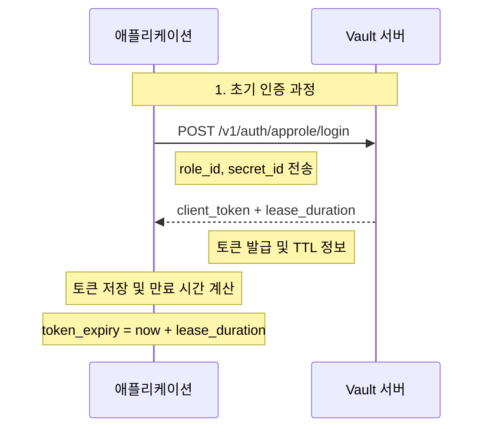
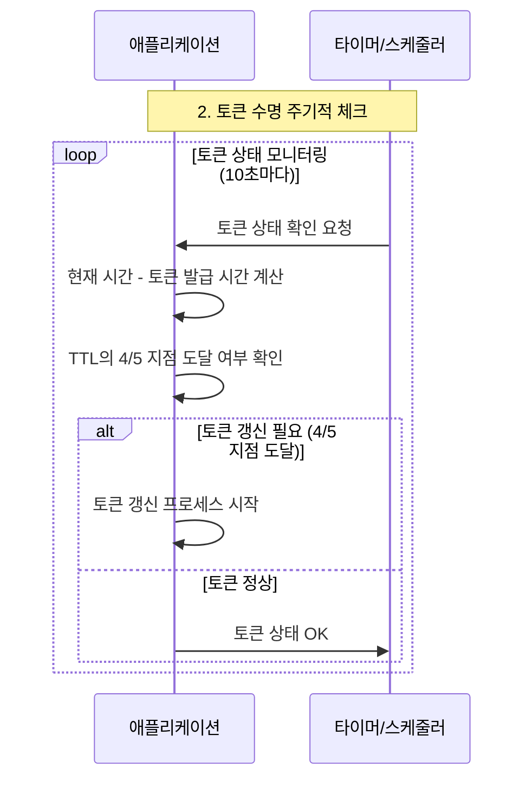
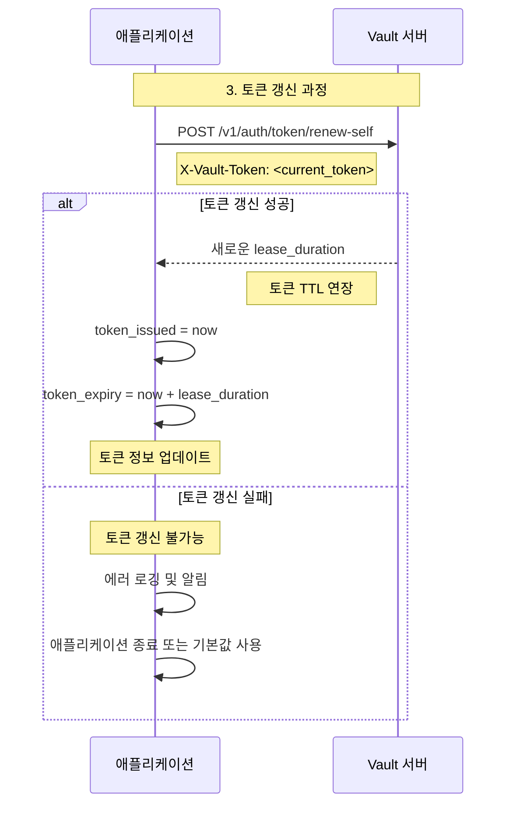
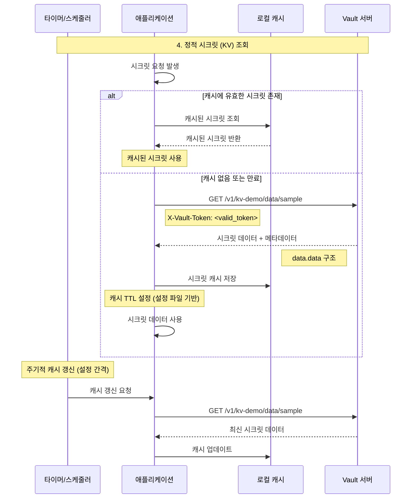
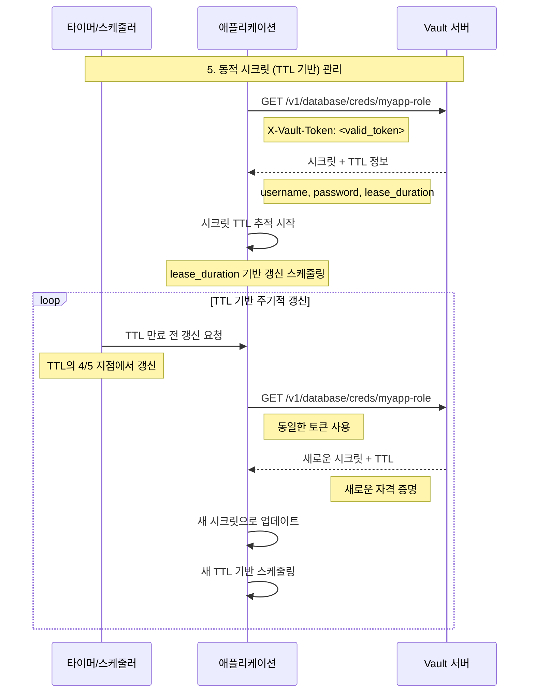
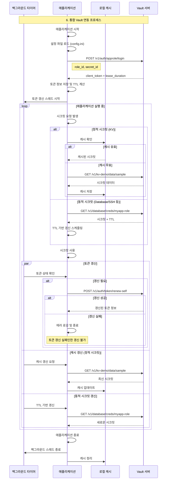
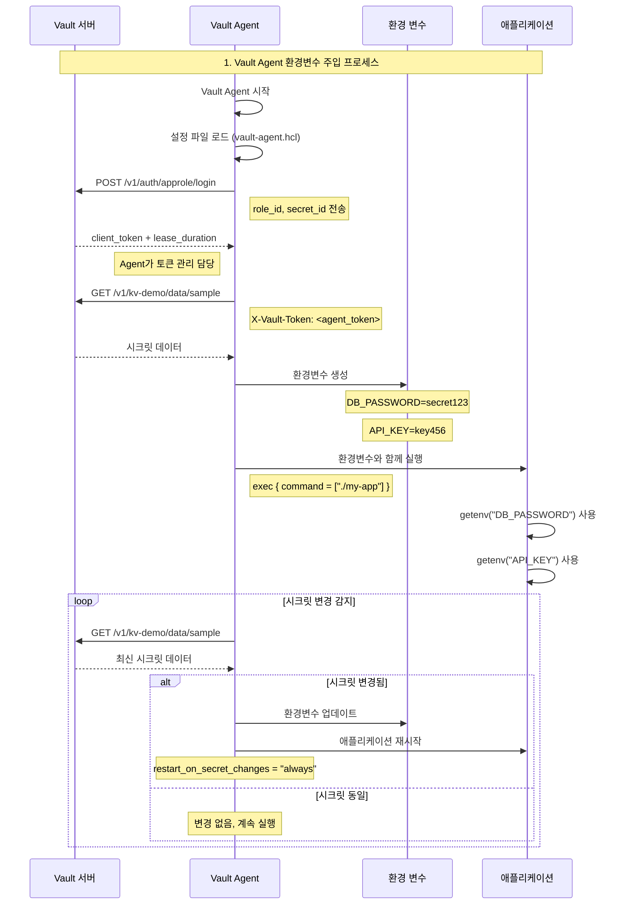
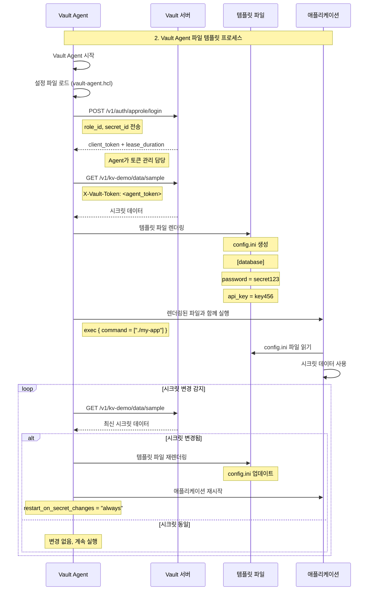

# 🔄 Vault 시크릿 연동 프로세스

## 📋 개요

이 문서는 애플리케이션이 Vault와 연동하여 시크릿을 안전하게 가져오는 전체 프로세스를 설명합니다. 언어에 상관없이 범용적으로 적용 가능한 절차를 sequence 다이어그램으로 표현합니다.

## 1안: Vault API 직접 연계 (권고안 ✅)

1. Vault 인증 및 토큰 발급
2. 토큰 상태 관리
3. 토큰 갱신 프로세스
4. 정적 시크릿 (KV) 가져오기
5. 동적 시크릿 (TTL 기반) 관리
6. 통합 프로세스 (전체 플로우)

---

### 🔐 1.1: Vault 인증 및 토큰 발급

#### AppRole 로그인 프로세스

#### 토큰 상태 관리

---

### 🔄 1.2: 토큰 갱신 프로세스

#### 토큰 갱신 및 실패 처리

---

### 🔑 1.3: 정적 시크릿 (KV) 가져오기

#### KV 시크릿 조회 및 캐싱

---

### ⏰ 1.4: 동적 시크릿 (TTL 기반) 관리

#### TTL 기반 시크릿 갱신

---

### 🔄 1.5: 통합 프로세스 (전체 플로우)

#### 완전한 Vault 연동 프로세스

---

## 2안: Vault Proxy 사용 (Token 관리가 불가능한 경우)

2안의 사용 조건은 다음과 같습니다.
- 2안은 1안의 프로세스 중 토큰 관리가 불가능한 경우에 사용합니다.
  - Script 같은 경우 멀티 쓰레딩으로 토큰 관리의 구현이 어렵습니다.
- Vault에 로그인 하기 위한 요소 (예: AppRole Secret_id, Password 등)를 관리하기 어려운 경우 사용합니다.

프로세스는 1안의 프로세스 중 로그인 및 토큰관리가 제외된 프로세스로 나머지 부분은 1안과 동일합니다.

1. 정적 시크릿 (KV) 가져오기
2. 동적 시크릿 (TTL 기반) 관리
3. 통합 프로세스 (전체 플로우)

---

## 3안: Vault Agent + 환경변수/파일 주입 (레거시 앱용)

3안의 사용 조건은 다음과 같습니다.
- 3안은 1안의 프로세스 중 토큰 관리가 불가능한 경우에 사용합니다.
- Script 같은 1회성 작업 보다는 영구적으로 실행되어야 하는 경우에 사용합니다.
- Vault에 로그인 하기 위한 요소 (예: AppRole Secret_id, Password 등)를 관리하기 어려운 경우 사용합니다.

### 🔧 3.1: 환경변수 생성 후 Command 실행

#### Vault Agent 환경변수 주입 프로세스

### 📄 3.2: 파일 템플릿 렌더링 후 Command 실행

#### Vault Agent 파일 템플릿 프로세스

---

## 🎯 핵심 원칙

### 1. **토큰 관리**
- 토큰은 TTL의 4/5 지점에서 갱신
- 갱신 실패 시 재로그인 시도하지 않음 (secret_id 만료 가능성)
- 백그라운드에서 지속적 모니터링

### 2. **시크릿 캐싱**
- 정적 시크릿: 설정 기반 캐시 TTL
- 동적 시크릿: Vault TTL 기반 자동 갱신
- 메모리에서만 저장, 파일 저장 금지

### 3. **에러 복구**
- 토큰 갱신 실패 시 애플리케이션 종료 또는 기본값 사용
- secret_id 만료 시 재로그인 시도하지 않음
- 실패 시 안전한 종료 또는 기본값 사용

### 4. **보안 고려사항**
- 시크릿은 메모리에서만 사용
- 로그에 시크릿 데이터 출력 금지
- 토큰 만료 시간 적절히 설정
- 정기적인 보안 감사 수행

---